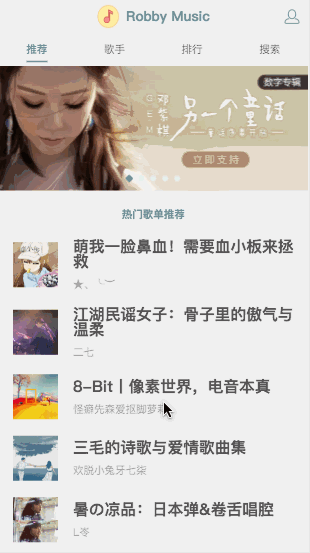
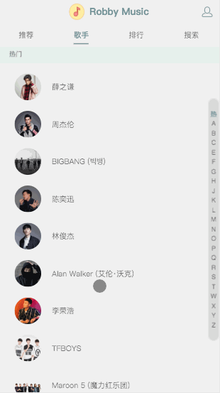
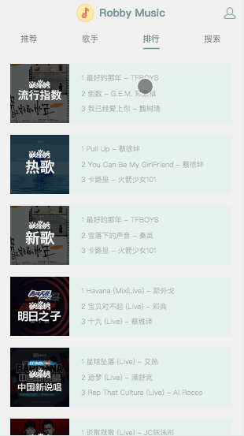
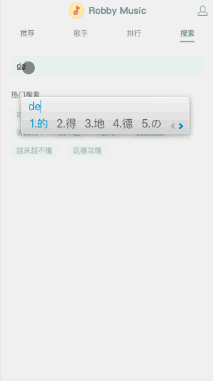

# 音乐播放器
> 一款移动端web music player🎵

## Demo
+ 🎵 [在线预览: 移动端web-music](https://robbyvan.cn/music)
+ 📱 使用手机浏览器打开获得更佳体验~


### 推荐

### 歌手

### 排行榜

### 搜索

### 播放器


## 技术
#### 前端
  + ```Vue + Vuex + Vue-router```: 采用Vue全家桶构建前端代码, 引入Vuex管理组件间共享状态, 页面路由采用Vue-router的hash模式管理, 同时利用路由懒加载优化首屏体验.
  + ```better-scroll```: 解决了移动端对于ScrollView的体验需求~
  + ```vue-lazyload```: 图片懒加载, 优化用户体验.

#### 后端
  + ```Express```: 采用express框架搭建api代理, 解决了部分前端跨域请求的问题

#### 部署
  + ```Nginx```: 采用Nginx实现反向代理
  + ```forever```: 结合实际访问量不大的情景, 采用forever, 简易方便


## 主要功能
播放器, 播放列表, 推荐, 歌手, 歌手详情, 榜单, 榜单详情, 搜索, 用户中心等

### 推荐
推荐页分为两部分, 轮播图 & 推荐歌单.
+ 轮播图采用better-scroll实现, 推荐歌单包裹在scroll组件当中, 实现ScrollView的滑动特性.

### 歌曲列表
+ 歌曲列表组件在多处进行复用, 用于各类详情页(如歌手详情, 榜单详情, 歌单详情等)的内容展示. 主要结构是背景图 & 歌曲列表.
+ 添加了移动端交互体验, 让用户的体验接近原生app

### 歌手
+ 采用首字母导航的结构, 通过监听touch事件实现字母栏和歌手列表的联动效果

### 搜索
+ 包括搜索框, 热搜词, 搜索结果三部分, 通过双向绑定实现实时搜索, 加入debounce实现防抖, 节约了http请求次数.

### 播放器
+ 实现音乐播放的组件, 通过其他页面对歌曲的点击修改vuex中相关state, 并触发```html5```的```<audio />```的播放/暂停
+ 唱片动画由```css3```的```animation```完成
+ 播放进度条的拖拽点击可以实时修改播放进度
+ 歌词通过```lyric-parser```进行处理, 与歌曲播放进度同步滚动/高亮

### 用户中心
+ 利用本地存储```localstorage```记录用户喜欢的歌曲, 最近播放

## Build Setup
```
  yarn        # install dependencies
  yarn dev    # dev server running at localhost:8080
  yarn build  # build for production, then run 'node prod.server.js' to start the server
```

